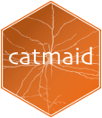

<!-- badges: start -->
[](https://travis-ci.org/natverse/rcatmaid)
[](https://github.com/natverse/rcatmaid/releases/latest) 
[](https://zenodo.org/badge/latestdoi/25650381)
[](https://natverse.github.io)
[](https://natverse.github.io/rcatmaid/reference/)
<!-- badges: end -->


# catmaid

This package provides access to the [CATMAID](http://catmaid.org/) API for 
[R](http://r-project.org/) users.  At present it provides low level functions 
for appropriately authenticated GET/POST requests, optionally parsing JSON responses.
There are also intermediate level functions that retrieve skeleton (i.e. neuron) 
information, connectivity information for one or more neurons as well as a number 
of other API endpoints. Finally, there is
a high level function to convert neurons to the representation of the
[nat](https://natvese.github.io/nat) (NeuroAnatomy Toolbox) R package, enabling
a wide variety of analyses.

It is strongly recommended to read through the instructions below, the [package
overview documentation](http://natverse.github.io/rcatmaid/reference/catmaid-package.html)
and then skim the [reference documentation index](http://natverse.github.io/rcatmaid/reference/)
, which groups the available functions into useful categories.

## Quick start
```r
# install
if (!require("remotes")) install.packages("remotes")
# nb repo is rcatmaid, but R package name is catmaid
remotes::install_github("natverse/rcatmaid")

# use 
library(catmaid)

# general help starting point
?catmaid
```
## Example
This example is based on EM tracing data from the Drosophila first instar larva
by [Albert Cardona and colleagues](https://elifesciences.org/articles/14859) as
submitted to [Virtual Fly Brain](https://virtualflybrain.org) and visible at https://catmaid.virtualflybrain.org.

This produces a 3D plot of first and second order olfactory neurons
coloured according to the peripheral odorant receptor.

```r
library(catmaid)
# Specify VFB CAMAID server containing data
conn=catmaid_login(server="https://l1em.catmaid.virtualflybrain.org")

# fetch olfactory receptor neurons
orns=read.neurons.catmaid("name:ORN (left|right)", .progress='text')
# calculate some useful metadata
orns[,'Or']= factor(sub(" ORN.*", "", orns[,'name']))
orns[,'side']= factor(sub(".* ORN ", "", orns[,'name']))

# repeat for their PN partners, note use of search by annotation
pns=read.neurons.catmaid("ORN PNs", .progress='text')
pns[,'Or']= factor(sub(" PN.*", "", pns[,'name']))
pns[,'side']= factor(sub(".*(left|right)", "\\1", pns[,'name']))
# plot, colouring by odorant receptor
plot3d(orns, col=Or)
# note that we plot somata with a radius of 1500 nm
plot3d(pns, col=Or, soma=1500)
```

Which produces the following output plot:

[]

## Authentication
You will obviously need to have the login details of a valid CATMAID instance to try 
this out. As of December 2015 CATMAID is moving to token based authentication. For this
you will need to get an API token when you are logged into the CATMAID web 
client in your browser. See http://catmaid.github.io/dev/api.html#api-token for
details. 

Once you have the login information you can use the `catmaid_login` function to 
authenticate. The minimal information is your server URL and your CATMAID token.

```r
catmaid_login(server="https://mycatmaidserver.org/catmaidroot",
              authname="Calvin",authpassword="hobbes",
              token="9944b09199c62bcf9418ad846dd0e4bbdfc6ee4b")
```

Note that the CATMAID servers that I am aware of require two layers of password
protection, an outer HTTP auth type user/password combination as well as an inner
CATMAID-specific token based login. The outer HTTP auth type user/password 
combination may be specific to you or generic to the project.

### Setting environment variables in your .Renviron file
It is recommended that you set your login details by including code like 
this in in your [.Renviron file](https://www.rdocumentation.org/packages/base/versions/3.4.0/topics/Startup):

```r
catmaid_server="https://mycatmaidserver.org/catmaidroot"
catmaid_token="9944b09199c62bcf9418ad846dd0e4bbdfc6ee4b"

# additional security for mycatmaidserver.org/catmaidroot page
catmaid_authname="Calvin"
catmaid_authpassword="hobbes"
```

In this way authentication will happen transparently as required by all functions
that interact with the specified CATMAID server.

Be sure to leave *one blank line* at the end of the .Renviron file, or it will not work.
Note that `catmaid_server` rather than `catmaid.server` is now the preferred form
of specifying environment variables (some shells do not like variables with periods in their name).
Note also that the use of package options in your `.Rprofile` file is still possible but now deprecated.

### Cached authentication 
Whether you use options in your `.Renviron` as described above or you login 
explicitly at the start of a session using `catmaid_login` the access credentials 
will be cached for the rest of the session. You can still authenticate explicitly
to a different CATMAID server (using `catmaid_login`) if you wish.

### Multiple servers
If you use more than one CATMAID server but always do so in different sessions
or rmarkdown scripts then you can save an appropriate `.Renviron` file in the 
project folder.

If you need to talk to more than one CATMAID server in a single session then you 
must use `catmaid_login` to login into each server

```r
# log in to default server specified in .Renviron/.Rprofile
conn1=catmaid_login()
# log into another server, presumably with different credentials
conn2=catmaid_login(server='https://my.otherserver.com', ...)
```

and then use the returned connection objects with any calls you make e.g.

```r
# fetch neuron from server 1
n1=read.neuron(123, conn=conn1)
# fetch neuron from server 2
n2=read.neuron(123, conn=conn2)
```
n.b. you must use connection objects to talk to both servers because if no 
connection object is specified, the last connection will be re-used.

## Installation
Currently there isn't a released version on [CRAN](https://cran.r-project.org/)
but can use the **devtools** package to install the development version:

```r
if (!require("remotes")) install.packages("remotes")
remotes::install_github("natverse/rcatmaid")
```

Note: Windows users need [Rtools](https://cran.r-project.org/bin/windows/Rtools/) and
[devtools](https://cran.r-project.org/package=devtools) to install this way.

## Acknowledgements

Originally based on python code presently visible at:

* https://github.com/catmaid/CATMAID/blob/master/scripts/remote/access.py
* https://github.com/catmaid/CATMAID/blob/master/django/applications/catmaid/urls.py
* https://github.com/schlegelp/CATMAID-to-Blender/blob/master/CATMAIDImport.py

by Albert Cardona and Philipp Schlegel. Released under the GPL-3 license.
